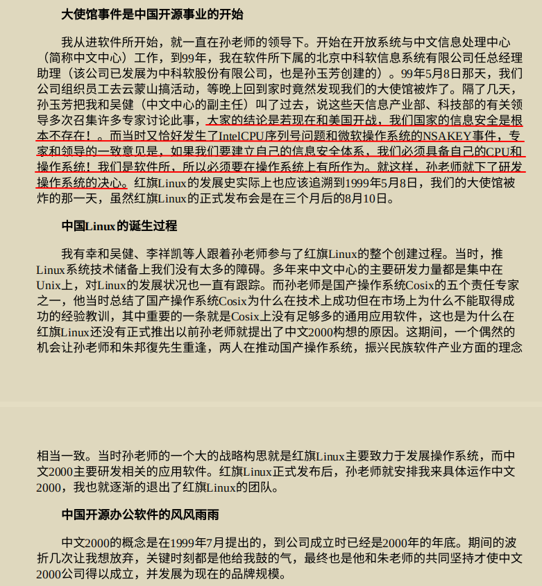

 

《🚩🇨🇳🔆🏹🌟👊🚀🦔大秦赋 - 黄埔军校赢家黄氏江夏堂》

大秦赋

# ✨✨®γσ ξηg（雷欧）✨✨

------------------------------------------------------------------------

   

 

✨✨✨

-   🔭 目前正在[官网：世博量化®](https://www.scibrokes.com)科研高频量化交易
-   🌱 目前正在学习计量经济学 ξconometrics
-   👯 [猫城：世博量化®](https://www.github.com/scibrokes)周公吐哺，天下归心。
-   🤔 目前需要计量经济学知音
-   💬 计量经济学兵法 / Arts of ξconometrics
-   📫 联系电邮信箱[Gmail](mailto:englianhu@gmail.com) / [Scimail](mailto:englianhu@scibrokes.com)
-   😄 拼音：®γσ
-   ⚡ 娱乐：ξconometrics（计量经济学）

[量化圈兵法：]{style="color:white; background-color:#4E79A7;"}

       

✨✨✨

   

------------------------------------------------------------------------

参考文献：

-   [How to create a GitHub profile README](https://youtu.be/vND_UY7xk24)
-   [GitHub Readme Stats](https://github.com/anuraghazra/github-readme-stats)
-   [GitHub Readme Background Gradient Coor `Update index.js #1082`](https://github.com/anuraghazra/github-readme-stats/pull/1082#issuecomment-847753937)
-   [UPDATE: Next Level GitHub Profile README (NEW) \| GitHub Actions \| Vercel \| Spotify](https://www.youtube.com/watch?v=n6d4KHSKqGk&t=107s)
-   [Next Level GitHub Profile README (NEW) \| How To Create An Amazing Profile ReadMe With GitHub Actions](https://www.youtube.com/watch?v=ECuqb5Tv9qI)
-   [猫舍： 世博量化®创办人简历](https://www.github.com/scibrokes/owner)
-   [®γσ on Rpubs.com](https://rpubs.com/englianhu)
-   [【案例】猫城：星外之神](https://github.com/wszqkzqk)

------------------------------------------------------------------------

[ Sςιβrοκεrs Trαdιηg®](http://www.scibrokes.com)  [[** 世博量化®**](http://www.scibrokes.com)**企业知识产权及版权所有，盗版必究。**]{style="color:RoyalBlue"}
